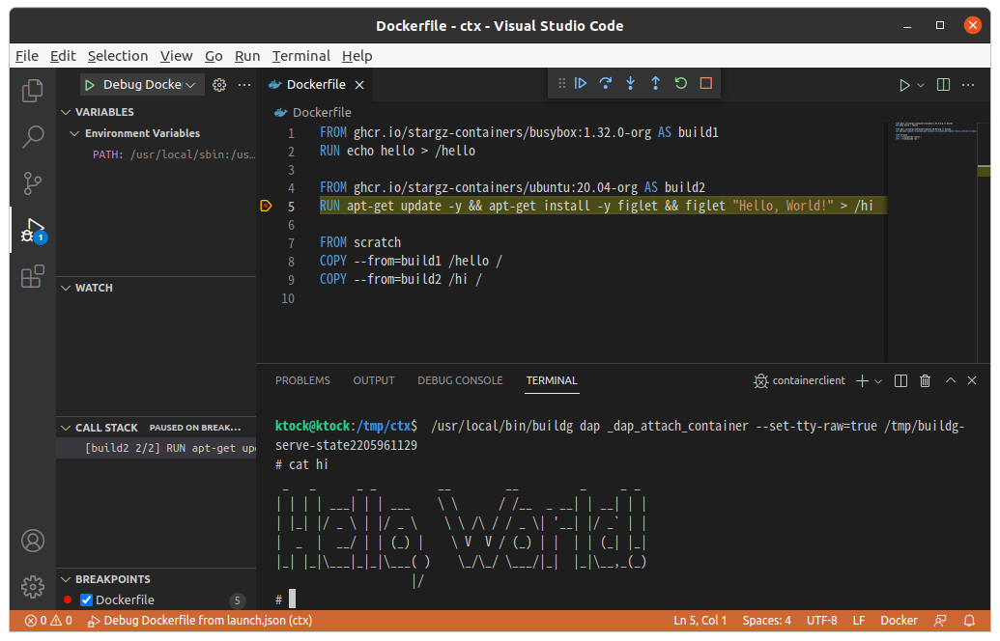

# Visual and Interactive Debugging of Dockerfile on editors via DAP (Debug Adapter Protocol)

Buildg allows visual and interactive debugging of Dockerfile on editors like VS Code, emacs and Neovim.

This is provided throgh [DAP(Debug Adapter Protocol)](https://microsoft.github.io/debug-adapter-protocol/) supported by editors [(official list)](https://microsoft.github.io/debug-adapter-protocol/implementors/tools/).

## Getting Started

- VS Code: https://github.com/ktock/vscode-buildg
- Emacs: [`./emacs`](./emacs)
- Neovim: [`./nvim`](./nvim)

Refer to the VS Code documentation for UI usage: https://code.visualstudio.com/docs/editor/debugging

## Repl commands

### exec

Execute command in the step.

Alias: `e`

Usage: `exec [OPTIONS] [ARGS...]`

If `ARGS` isn't provided, `/bin/sh` is used by default.

Flags:

- `--image`: Execute command in the debuger image specified by `image` property in the lauch configuration. If not specified, the command is executed on the rootfs of the current step.
- `--mountroot value`: Mountpoint to mount the rootfs of the step. ignored if `--image` isn't specified. (default: `/debugroot`)
- `--init-state`: Execute commands in an initial state of that step (experimental)
- `--tty`, `-t`: Allocate tty (enabled by default)
- `-i`: Enable stdin. (FIXME: must be set with tty) (enabled by default)
- `--env value`, `-e value`: Set environment variables
- `--workdir value`, `-w value`: Working directory inside the container

### help

Shows a list of commands or help for one command

Alias: `h`

Usage: `help [COMMAND]`

## Launch Configuration

In the launch configuration (e.g. `launch.json` on VS Code), the following properties are provided.

- `program` *string* **REQUIRED** : Absolute path to Dockerfile.
- `stopOnEntry` *boolean* : Automatically stop after launch. (default: `true`)
- `target` *string* : Target build stage to build.
- `image` *string* : Image to use for debugging stage.
- `build-args` *array* : Build-time variables.
- `ssh` *array* : Allow forwarding SSH agent to the build. Format: `default|<id>[=<socket>|<key>[,<key>]]`
- `secrets` *array* : Expose secret value to the build. Format: `id=secretname,src=filepath`

Common and mandatory properties are the following (see [VS Code documentation](https://code.visualstudio.com/docs/editor/debugging#_launchjson-attributes) for details).

- `type` : Type of debugger to use. Must be `dockerfile`.
- `request` : The request type. `launch` is only supported in buildg as of now.
- `name` : The reader-friendly name of this configuration.

## Known Limitations

Following lists the current known limitations that should be eliminated in the futural version.

- `Step Into` and `Step Out` in Debug toolbar is unsupported in buildg. To inspect instructions deeper, you can use [`exec`](#exec) REPL command instead.
- Logpoint, conditional, function and data breakpoints aren't supported.
- Setting value to a variable isn't supported.
- `attach` request type in launch configuration isn't supported.
