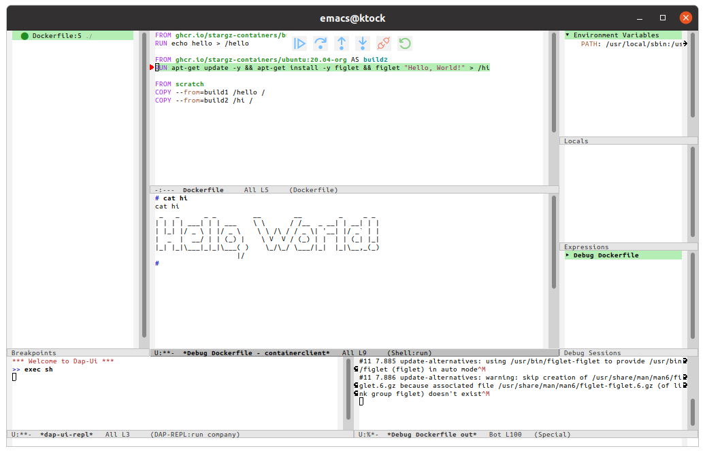

# Buildg on emacs

Buildg supports interactive debugging of Dockerfile on emacs.

## Install

- Requirements
  - buildg
  - [dap-mode](https://github.com/emacs-lsp/dap-mode)
    - configuration guide: https://emacs-lsp.github.io/dap-mode/page/configuration/

Then add the example launch configuration shown in [`./dap-dockerfile.el`](./dap-dockerfile.el) to your `init.el`.
Also refer to [`../README.md`](../README.md) for available properties in the launch configuration.

## Usage

Run `M-x dap-debug` then select `Dockerfile Debug Configuration` template.

dap-mode also supports `launch.json` of VS Code. 
dap-mode looks up `launch.json` under `(lsp-workspace-root)` and loads it.
Refer to the [dap-mode document](https://github.com/emacs-lsp/dap-mode/blob/5e449c864107e08353fd21c44897c4d480190d94/docs/page/features.md#launchjson-support) for details.
