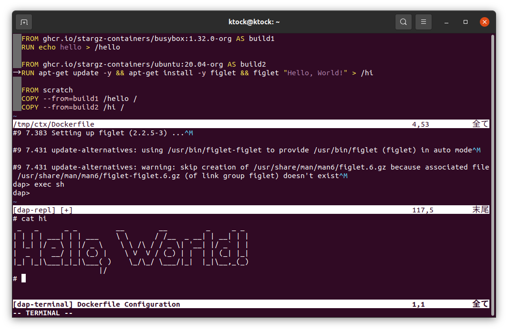

# Buildg on Neovim

Buildg supports interactive debugging of Dockerfile on Neovim.

This depends on [nvim-dap](https://github.com/mfussenegger/nvim-dap/blob/master/doc/dap.txt).



## Install

- Requirements
  - Neovim (>= 0.6)
  - buildg

- Via [packer.nvim](https://github.com/wbthomason/packer.nvim)
  - Add the example launch configuration shown in [`./plugins.lua`](./plugins.lua) to your packer configuration (e.g. `~/.config/nvim/init.lua`, `~/.config/nvim/lua/plugins.lua`, etc.).
    - Also refer to [`../README.md`](../README.md) for available properties in the launch configuration.

## Usage

```
nvim /path/to/Dockerfile
```

nvim-dap also supports a subset of `launch.json` of VS Code. 
`:lua require('dap.ext.vscode').load_launchjs()` searches `launch.json` under the current working directory and loads it.
Refer to the [nvim-dap document](https://github.com/mfussenegger/nvim-dap/blob/f4a3be57f61893cffa1e22aa5e1e7bded495fcf2/doc/dap.txt#L231-L283) for details.

See also [`:help dap.txt`](https://github.com/mfussenegger/nvim-dap/blob/master/doc/dap.txt) of nvim-dap for available commands.
